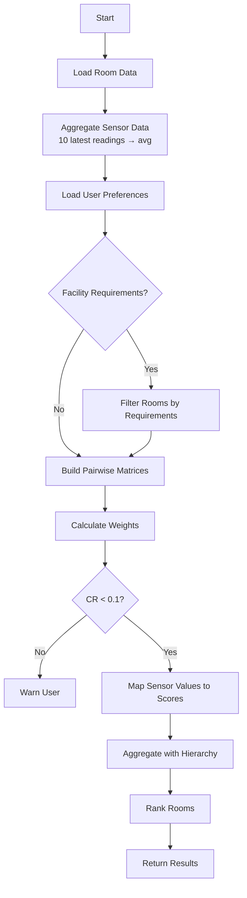

# AHP Algorithm Documentation

> **Complete documentation of the Analytic Hierarchy Process (AHP) implementation for the IoT Room Selection Decision Support System.**

## Table of Contents
1. [Overview](#overview)
2. [Criteria Hierarchy](#criteria-hierarchy)
3. [Pairwise Comparison Matrix](#pairwise-comparison-matrix)
4. [Eigenvector Weight Calculation](#eigenvector-weight-calculation)
5. [Consistency Ratio Validation](#consistency-ratio-validation)
6. [Score Mapping Functions](#score-mapping-functions)
7. [Final Score Aggregation](#final-score-aggregation)
8. [Algorithm Workflow](#algorithm-workflow)

---

## Overview

The **Analytic Hierarchy Process (AHP)** is a structured multi-criteria decision-making method developed by Thomas L. Saaty in the 1970s. It helps users make complex decisions by:

1. Decomposing the problem into a hierarchy
2. Making pairwise comparisons between elements
3. Calculating priority weights using eigenvalue methods
4. Validating consistency of judgments
5. Aggregating all criteria into a final score

Our implementation ranks **rooms** based on **sensor data** and **user preferences**.

---

## Criteria Hierarchy

We use a **3-level hierarchy**:

```
                    🏢 Select Best Room (Goal)
                              │
        ┌─────────────────────┼─────────────────────┐
        │                     │                     │
   ┌────▼────┐          ┌─────▼────┐          ┌────▼─────┐
   │ Comfort │          │  Health  │          │ Usability│
   │  (40%)  │          │  (35%)   │          │  (25%)   │
   └────┬────┘          └────┬─────┘          └────┬─────┘
        │                    │                     │
   ┌────┴────┐          ┌────┴────┐           ┌────┴────┐
   │         │          │         │           │         │
┌──▼───┐ ┌───▼────┐  ┌──▼──┐ ┌───▼───┐   ┌──▼───┐ ┌──▼───┐ ┌──▼───┐
│ Temp │ │Lighting│  │ CO2 │ │  VOC  │   │Seats │ │Equip │ │ A/V  │
│      │ │        │  │     │ │       │   │      │ │      │ │      │
│Noise │ │Humidity│  │ AQI │ │ PM2.5 │   │      │ │      │ │      │
│      │ │        │  │     │ │       │   │      │ │      │ │      │
│      │ │        │  │     │ │ PM10  │   │      │ │      │ │      │
└──────┘ └────────┘  └─────┘ └───────┘   └──────┘ └──────┘ └──────┘
```

### Justification of Criteria

| Main Criterion | Weight | Why |
|----------------|--------|-----|
| **Comfort** | 40% | Primary concern for productivity and well-being |
| **Health** | 35% | Indoor air quality directly impacts cognitive function |
| **Usability** | 25% | Room must meet functional requirements |

### Sub-Criteria Mapping

| Sub-Criterion | Parent | Sensor Source | Standard |
|---------------|--------|---------------|----------|
| Temperature | Comfort | `temperature_sensor_data.json` | EN 16798-1 |
| Lighting | Comfort | `LightIntensity_sensor_data.json` | EN 12464-1 |
| Noise | Comfort | `sound_sensor_data.json` | EN 16798-1 |
| Humidity | Comfort | `humidity_sensor_data.json` | EN 16798-1 |
| CO2 | Health | `co2_sensor_data.json` | EN 16798-1 |
| Air Quality | Health | `air_quality_sensor_data.json` | US EPA |
| VOC | Health | `voc_sensor_data.json` | WELL Standard |
| PM2.5 | Health | `air_quality_sensor_data.json` | WHO 2021 |
| PM10 | Health | `air_quality_sensor_data.json` | WHO 2021 |
| Seating | Usability | `room_facilities_data.json` | - |
| Equipment | Usability | `room_facilities_data.json` | - |
| A/V Facilities | Usability | `room_facilities_data.json` | - |

---

## Pairwise Comparison Matrix

Users express preferences using the **Saaty 1-9 Scale**:

| Value | Meaning | Example |
|-------|---------|---------|
| 1 | Equal importance | Temp = Humidity |
| 3 | Moderate importance | Temp > Humidity slightly |
| 5 | Strong importance | Temp >> Humidity |
| 7 | Very strong | Temp >>> Humidity |
| 9 | Absolute | Temp is only thing that matters |

### Example Matrix (Main Criteria)

```
          Comfort  Health   Usability
Comfort   [ 1.0    1.2      2.0  ]     
Health    [ 0.83   1.0      1.5  ]     
Usability [ 0.5    0.67     1.0  ]     
```

**Key Property:** Reciprocal — if `A[i,j] = x`, then `A[j,i] = 1/x`

---

## Eigenvector Weight Calculation

### Mathematical Foundation

Given comparison matrix **A**, we find the **principal eigenvector** corresponding to the **maximum eigenvalue** λ_max:

```
A · w = λ_max · w
```

Where:
- `A` = n×n comparison matrix
- `w` = priority weight vector
- `λ_max` = maximum eigenvalue

### Calculation Methods

We implement three methods:

1. **Eigenvector Method** (default, most accurate):
   - Compute eigenvalues/eigenvectors using `numpy.linalg.eig()`
   - Select eigenvector for largest real eigenvalue
   - Normalize to sum to 1

2. **Geometric Mean Method** (faster approximation):
   ```
   w_i = (∏_{j=1}^n a_{ij})^{1/n} / Σ_k (∏_{j=1}^n a_{kj})^{1/n}
   ```

3. **Normalized Column Sum** (simplest):
   - Normalize each column to sum to 1
   - Average across rows

### Example Output

```
Main Criteria Weights:
  Comfort:   0.4286 (42.9%)
  Health:    0.3571 (35.7%)
  Usability: 0.2143 (21.4%)
```

---

## Consistency Ratio Validation

### Why Consistency Matters

Human judgments can be inconsistent. If someone says:
- A > B (A is better than B)
- B > C
- C > A (contradicts!)

The AHP requires a **Consistency Ratio (CR) < 0.1** (10%) for valid judgments.

### Calculation

1. **Consistency Index (CI)**:
   ```
   CI = (λ_max - n) / (n - 1)
   ```
   Where `n` = matrix size

2. **Random Index (RI)** - from Saaty's research:

   | n | 1 | 2 | 3 | 4 | 5 | 6 | 7 | 8 |
   |---|---|---|---|---|---|---|---|---|
   | RI| 0 | 0 | 0.58 | 0.90 | 1.12 | 1.24 | 1.32 | 1.41 |

3. **Consistency Ratio (CR)**:
   ```
   CR = CI / RI
   ```

### Interpretation

| CR Value | Interpretation |
|----------|----------------|
| CR = 0 | Perfectly consistent |
| CR < 0.1 | Acceptably consistent ✓ |
| CR ≥ 0.1 | Inconsistent ✗ (revise judgments) |

---

## Score Mapping Functions

Raw sensor values are mapped to normalized scores (0-1) based on **EU Standards (EN 16798-1)**.

### Mapping Types

1. **Centered Range** (optimal in middle): Temperature, Humidity, Light
2. **Lower is Better**: CO2, Noise, VOC, AQI

### Temperature Mapping Example

```
Score 1.0  ─────────────────────┐
                                │  ← Optimal (20-24°C)
Score 0.5  ──────────┐          │
                     │          │  ← Acceptable (18-26°C) 
Score 0.0  ──────────┴──────────┴──────────
           15°C     18°C      24°C     30°C
```

### All Thresholds (Category II EN 16798-1 & WHO 2021)

| Criterion | Optimal Range | Acceptable Range | Source |
|-----------|---------------|------------------|--------|
| Temperature | 20-24°C (winter) / 23-26°C (summer) | 18-27°C | EN 16798-1 Cat II |
| CO2 | ≤ 800 ppm | ≤ 1000 ppm | EN 16798-1 Cat II |
| Humidity | 40-60% | 30-70% | EN 16798-1 |
| Lighting | 300-500 lux | 200-750 lux | EN 12464-1 |
| Noise | ≤ 35 dBA | ≤ 45 dBA | EN 16798-1 / WHO |
| VOC | ≤ 200 ppb | ≤ 400 ppb | WELL Standard |
| PM2.5 | ≤ 15 μg/m³ | ≤ 35 μg/m³ | WHO 2021 |
| PM10 | ≤ 45 μg/m³ | ≤ 75 μg/m³ | WHO 2021 |
| AQI | ≤ 50 | ≤ 100 | US EPA |

---

## Final Score Aggregation

### Weighted Sum Model (WSM)

Default method - compensatory (high values can offset low values):

```
Score_room = Σ (w_i × s_i)
```

Where:
- `w_i` = global weight of criterion i
- `s_i` = normalized score for criterion i

### Weighted Product Model (WPM)

Non-compensatory (zeros heavily penalize):

```
Score_room = Π (s_i ^ w_i)
```

### Combined Method

Uses both for robustness:
```
Score = 0.7 × WSM + 0.3 × WPM
```

---

## Sensor Data Preprocessing

Before AHP scoring begins, raw sensor readings are aggregated to produce representative values for each room:

| Step | Description |
|------|-------------|
| 1. **Fetch** | Query MongoDB for all sensor readings by room and type |
| 2. **Sort** | Order by timestamp (newest first) |
| 3. **Slice** | Take the 10 most recent readings |
| 4. **Average** | Calculate mean of these 10 values |

This rolling average smooths out transient spikes while keeping the data relatively recent. The resulting value is then passed to the score mapping functions.

## Algorithm Workflow



### Pre-Filter: Facility Requirements

Before AHP scoring, users can specify **hard constraints** to filter rooms:

| Constraint | Description |
|------------|-------------|
| Minimum Seats | Exclude rooms with fewer seats than required |
| Require Projector | Exclude rooms without a projector |
| Require Computers | Exclude rooms without computers |

These are pass/fail criteria - rooms either meet all requirements or are excluded from ranking.

### Step-by-Step

1. **Initialize** default weights
2. **Filter** rooms by facility requirements (if specified)
3. **Accept** user preference comparisons (optional)
4. **Calculate** weights via eigenvector method
5. **Validate** consistency (CR < 0.1)
6. **Map** each sensor reading to 0-1 score
7. **Aggregate** bottom-up through hierarchy
8. **Rank** rooms by final score

---

## Usage Example

```python
from backend.app.ahp import AHPEngine, RoomData, UserRequirements

# Initialize engine
engine = AHPEngine()

# Customize preferences (optional)
engine.set_user_preferences(
    main_comparisons={
        ("Health", "Comfort"): 3,  # Health 3x more important
    }
)

# Load rooms
engine.load_room_data([
    RoomData(room_id="R1", room_name="Room 1", temperature=22.0, co2=500),
    RoomData(room_id="R2", room_name="Room 2", temperature=28.0, co2=1200),
])

# Set hard facility requirements (pre-filter)
engine.set_requirements(UserRequirements(
    min_seating=20,           # Must have at least 20 seats
    require_projector=True,   # Must have projector
    require_computers=False,  # Computers not required
))

# Evaluate and rank (only rooms meeting requirements are scored)
result = engine.evaluate_rooms()

# Print results
for room in result.rankings:
    print(f"{room.rank}. {room.room_name}: {room.final_score:.2%}")
```

---

## References

1. Saaty, T.L. (1980). *The Analytic Hierarchy Process*
2. EN 16798-1:2019 - Indoor Environmental Quality
3. EN 12464-1 - Lighting of Work Places
4. WHO Guidelines for Indoor Air Quality
